# HW4. SELECT и JOIN


## 1. SELECT

### Выборка всех данных из таблицы

**Запрос 1.** Все фильмы.

```sql
SELECT * FROM Movie;
```

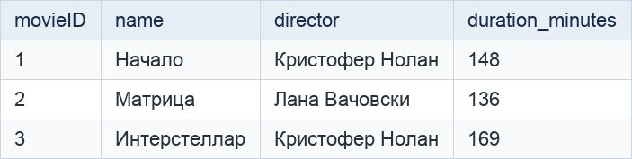

**Запрос 2.** Все сеансы.

```sql
SELECT * FROM Session;
```

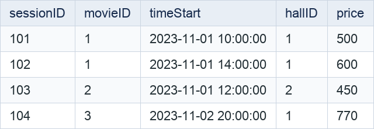

### Выборка отдельных столбцов

**Запрос 3.** Названия и продолжительность фильмов.

```sql
SELECT name, duration_minutes FROM Movie;
```

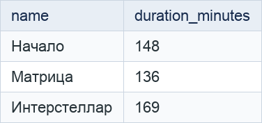

**Запрос 4.** Время начала и цена сеансов.

```sql
SELECT timeStart, price FROM Session;
```

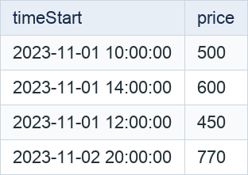

### Присвоение новых имен столбцам при формировании выборки

**Запрос 5.** Переименовать столбцы фильмов в результате.

```sql
SELECT name AS "Название", duration_minutes AS "Длительность"
FROM Movie;
```

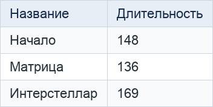

**Запрос 6.** Переименовать столбцы билетов в результате.

```sql
SELECT ticketID AS "Номер_билета", status AS "Статус"
FROM Ticket;
```

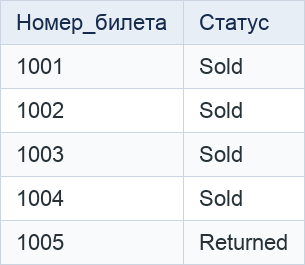

### Выборка данных с созданием вычисляемого столбца

**Запрос 7.** Цена двух билетов на каждый сеанс.

```sql
SELECT sessionID, price, price * 2 AS price_for_two
FROM Session;
```

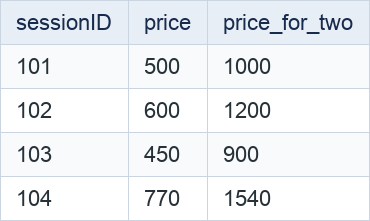

**Запрос 8.** Продолжительность фильмов в часах.

```sql
SELECT name, duration_minutes, duration_minutes / 60.0 AS duration_hours
FROM Movie;
```

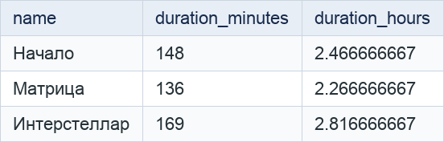

### Выборка данных, вычисляемые столбцы, математические функции

**Запрос 9.** Округлить цену сеанса со скидкой 15%.

```sql
SELECT sessionID, ROUND(price * 0.85, 2) AS discounted_price
FROM Session;
```

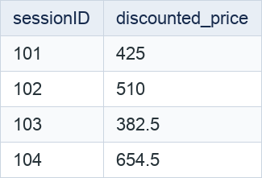

**Запрос 10.** Округлить продолжительность фильма в часах вверх.

```sql
SELECT name, CEIL(duration_minutes / 60.0) AS rounded_hours
FROM Movie;
```

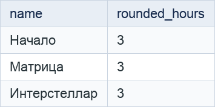

### Выборка данных, вычисляемые столбцы, логические функции

**Запрос 11.** Указать, является ли место VIP, с помощью логического выражения.

```sql
SELECT placeID, seat_type, seat_type = 'VIP' AS is_vip
FROM Place;
```

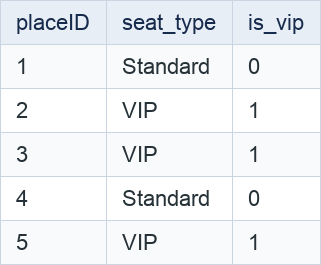

**Запрос 12.** Указать, превышает ли цена сеанса 600 рублей.

```sql
SELECT sessionID, price, price > 600 AS is_expensive
FROM Session;
```

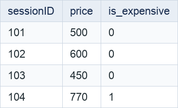

### Выборка данных по условию

**Запрос 13.** Фильмы продолжительностью более 140 минут.

```sql
SELECT name, duration_minutes
FROM Movie
WHERE duration_minutes > 140;
```

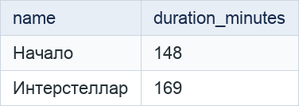

**Запрос 14.** Сеансы дешевле 600 рублей.

```sql
SELECT sessionID, timeStart, price
FROM Session
WHERE price < 600;
```

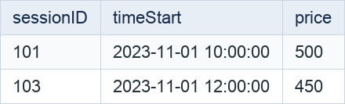

### Выборка данных, логические операции

**Запрос 15.** Сеансы в первом зале с ценой от 500 рублей.

```sql
SELECT sessionID, hallID, price
FROM Session
WHERE hallID = 1 AND price >= 500;
```

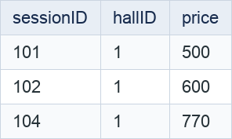

**Запрос 16.** Проданные или забронированные билеты, для которых указан email.

```sql
SELECT ticketID, status, customer_email
FROM Ticket
WHERE (status = 'Sold' OR status = 'Booked')
  AND NOT (customer_email IS NULL);
```

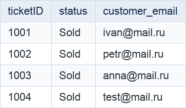

### Выборка данных, операторы BETWEEN, IN

**Запрос 17.** Сеансы с ценой от 450 до 650 рублей включительно (BETWEEN).

```sql
SELECT sessionID, price
FROM Session
WHERE price BETWEEN 450 AND 650;
```

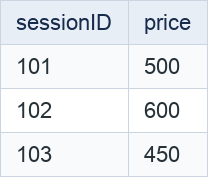

**Запрос 18.** Проданные и забронированные билеты (IN).

```sql
SELECT ticketID, status
FROM Ticket
WHERE status IN ('Sold', 'Booked');
```

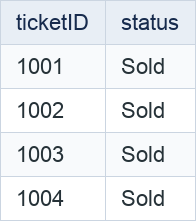

### Выборка данных с сортировкой

**Запрос 19.** Фильмы по алфавиту.

```sql
SELECT movieID, name
FROM Movie
ORDER BY name ASC, movieID ASC;
```

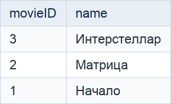

**Запрос 20.** Сеансы по убыванию цены, затем по времени начала.

```sql
SELECT sessionID, timeStart, price
FROM Session
ORDER BY price DESC, timeStart ASC, sessionID ASC;
```

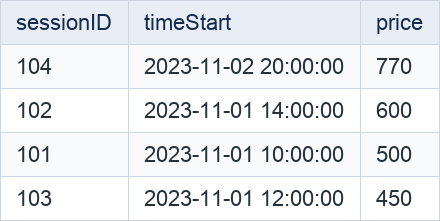

### Выборка данных, оператор LIKE

**Запрос 21.** Фильмы, название которых начинается с «И».

```sql
SELECT movieID, name
FROM Movie
WHERE name LIKE 'И%';
```

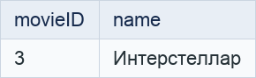

**Запрос 22.** Билеты с адресами электронной почты на mail.ru.

```sql
SELECT ticketID, customer_email
FROM Ticket
WHERE customer_email LIKE '%@mail.ru';
```

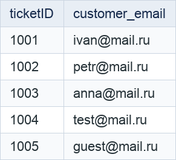

### Выбор уникальных элементов столбца

**Запрос 23.** Уникальные типы мест.

```sql
SELECT DISTINCT seat_type FROM Place;
```

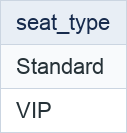

**Запрос 24.** Уникальные статусы билетов.

```sql
SELECT DISTINCT status FROM Ticket;
```

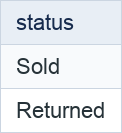

### Выбор ограниченного количества возвращаемых строк.

**Запрос 25.** Два самых дешёвых сеанса.

```sql
SELECT sessionID, price
FROM Session
ORDER BY price ASC, sessionID ASC
LIMIT 2;
```

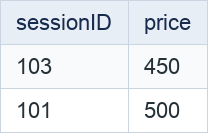

**Запрос 26.** Следующие два фильма после первого по порядку идентификаторов.

```sql
SELECT movieID, name
FROM Movie
ORDER BY movieID ASC
LIMIT 2 OFFSET 1;
```

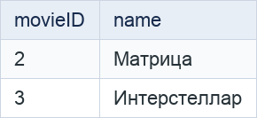

### CASE

**Запрос 27.** Классифицировать фильмы по продолжительности (CASE с условиями).

```sql
SELECT name, duration_minutes,
       CASE
           WHEN duration_minutes IS NULL THEN 'Неизвестно'
           WHEN duration_minutes < 140 THEN 'До 140 минут'
           WHEN duration_minutes <= 160 THEN 'От 140 до 160 минут'
           ELSE 'Более 160 минут'
       END AS duration_category
FROM Movie;
```

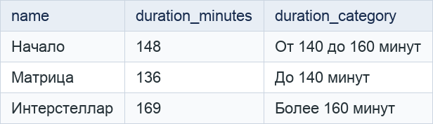

**Запрос 28.** Вывести статусы билетов на русском языке (CASE по значению).

```sql
SELECT ticketID,
       CASE status
           WHEN 'Sold' THEN 'Продан'
           WHEN 'Booked' THEN 'Забронирован'
           WHEN 'Returned' THEN 'Возвращён'
           ELSE 'Неизвестный статус'
       END AS status_description
FROM Ticket;
```

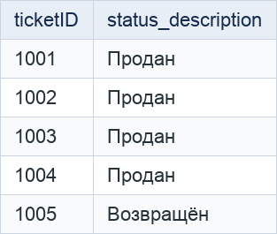

## 2. JOIN

### Соединение INNER JOIN

**Запрос 29.** Сеансы с названиями соответствующих фильмов.

```sql
SELECT s.sessionID, m.name, s.timeStart
FROM Session AS s
INNER JOIN Movie AS m ON m.movieID = s.movieID;
```

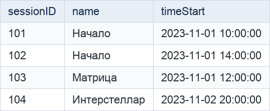

**Запрос 30.** Места с адресами их залов.

```sql
SELECT p.placeID, p.seat_type, h.address
FROM Place AS p
INNER JOIN Hall AS h ON h.hallID = p.hallID;
```

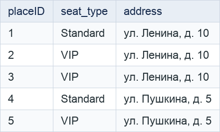

### Внешнее соединение LEFT JOIN

**Запрос 31.** Все фильмы и их сеансы; для фильма без сеансов поля сеанса будут NULL.

```sql
SELECT m.movieID, m.name, s.sessionID, s.timeStart
FROM Movie AS m
LEFT JOIN Session AS s ON s.movieID = m.movieID;
```

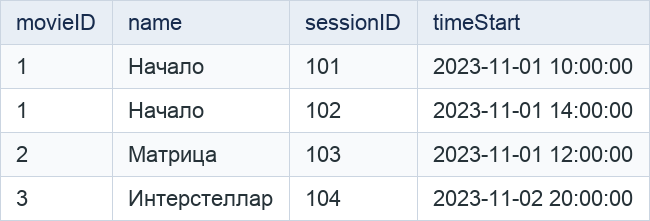

**Запрос 32.** Все места и связанные с ними билеты; места без билетов также включаются.

```sql
SELECT p.placeID, p.hallID, t.ticketID, t.status
FROM Place AS p
LEFT JOIN Ticket AS t ON t.placeID = p.placeID;
```

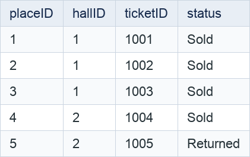

### Внешнее соединение RIGHT JOIN

**Запрос 33.** Все залы и их сеансы; зал без сеансов также включается.

```sql
SELECT h.hallID, h.address, s.sessionID, s.timeStart
FROM Session AS s
RIGHT JOIN Hall AS h ON h.hallID = s.hallID;
```

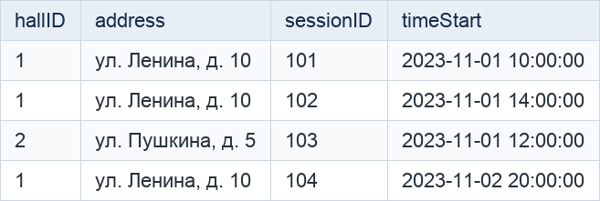

**Запрос 34.** Все сеансы и их билеты; сеанс без билетов также включается.

```sql
SELECT s.sessionID, s.timeStart, t.ticketID, t.status
FROM Ticket AS t
RIGHT JOIN Session AS s ON s.sessionID = t.sessionID;
```

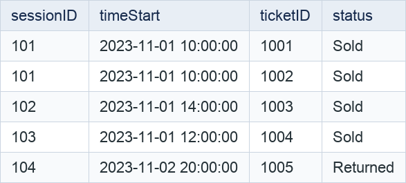

### Перекрестное соединение CROSS JOIN

**Запрос 35.** Все возможные сочетания фильмов и залов для планирования расписания.

```sql
SELECT m.movieID, m.name, h.hallID, h.address
FROM Movie AS m
CROSS JOIN Hall AS h;
```

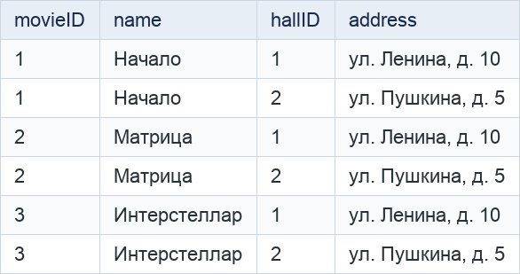

**Запрос 36.** Все возможные сочетания фильмов и типов мест.

```sql
SELECT m.movieID, m.name, st.seat_type
FROM Movie AS m
CROSS JOIN (SELECT DISTINCT seat_type FROM Place) AS st;
```

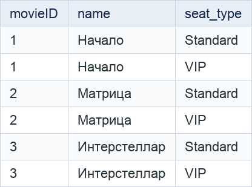

### Внешнее соединение FULL JOIN

**Запрос 37.** Все фильмы и сеансы, включая фильмы без сеансов и сеансы без указанного фильма.

```sql
SELECT m.movieID, m.name, s.sessionID, s.timeStart
FROM Movie AS m
FULL JOIN Session AS s ON s.movieID = m.movieID;
```


**Запрос 38.** Все места и билеты, включая места без билетов и билеты без указанного места.

```sql
SELECT p.placeID, p.hallID, t.ticketID, t.status
FROM Place AS p
FULL JOIN Ticket AS t ON t.placeID = p.placeID;
```


### Запросы на выборку из нескольких таблиц

**Запрос 39.** Расписание с названиями фильмов и адресами залов.

```sql
SELECT s.sessionID, m.name, h.address, s.timeStart, s.price
FROM Session AS s
INNER JOIN Movie AS m ON m.movieID = s.movieID
INNER JOIN Hall AS h ON h.hallID = s.hallID;
```

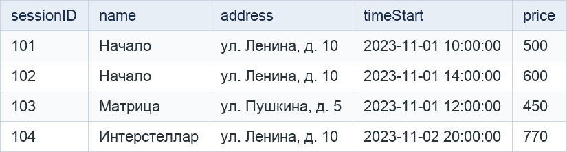

**Запрос 40.** Билеты с названием фильма, временем сеанса и типом места.

```sql
SELECT t.ticketID, t.status, m.name, s.timeStart, p.seat_type
FROM Ticket AS t
INNER JOIN Session AS s ON s.sessionID = t.sessionID
INNER JOIN Movie AS m ON m.movieID = s.movieID
INNER JOIN Place AS p ON p.placeID = t.placeID;
```

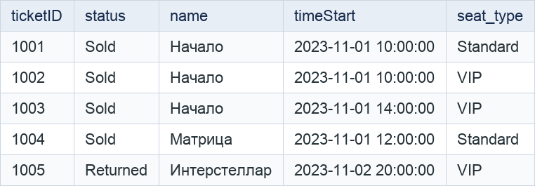
